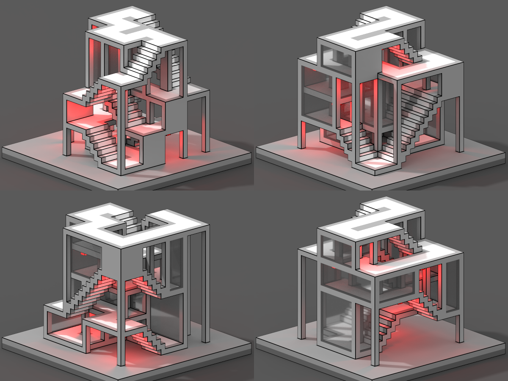
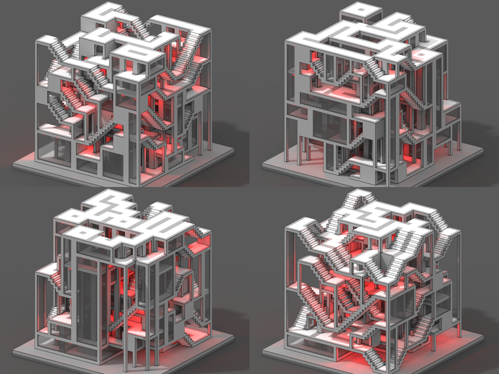
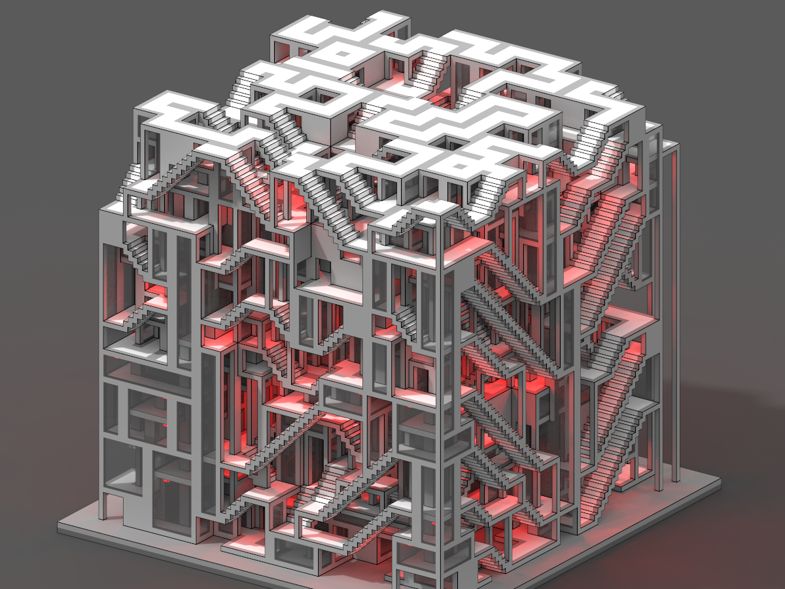
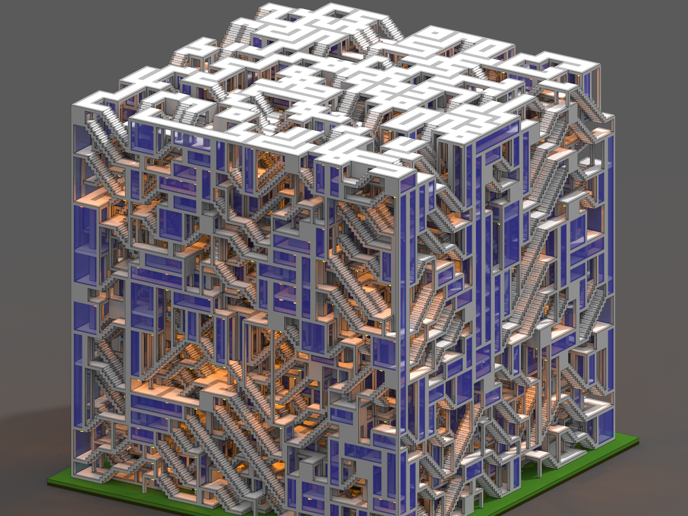

# Apartemazements
Procedural apartemazements, for a modern minotaur to live in.

MarkovJunior model: [Apartemazements.xml](https://github.com/mxgmn/MarkovJunior/blob/master/models/Apartemazements.xml)

Generation process: [https://youtu.be/PWyQ8Xy_lic](https://youtu.be/PWyQ8Xy_lic)

Collection of generated results: [https://youtu.be/27Ye1JpcLO4](https://youtu.be/27Ye1JpcLO4)

Twitter post: [twitter.com/exutumno/status/885128566173728768](https://twitter.com/exutumno/status/885128566173728768)

