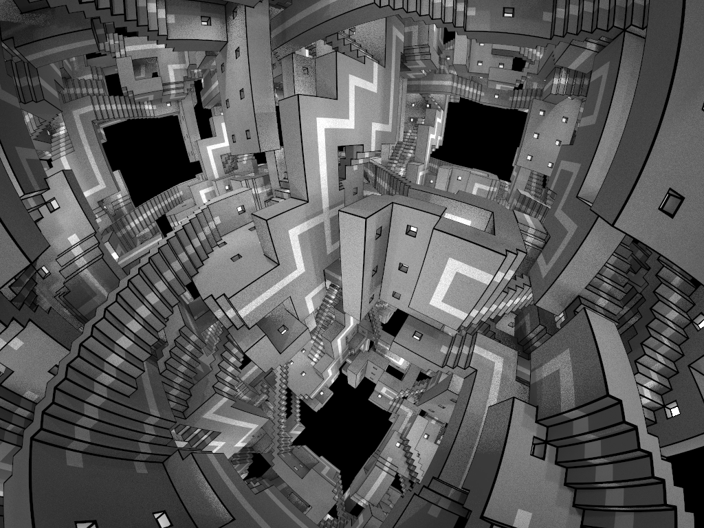
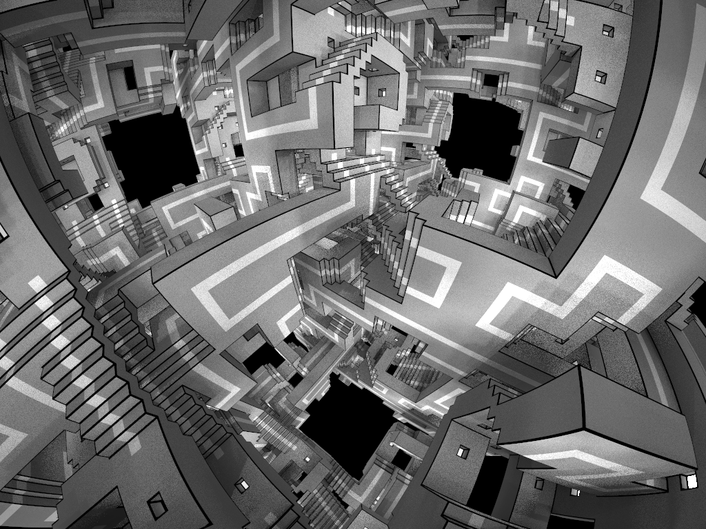
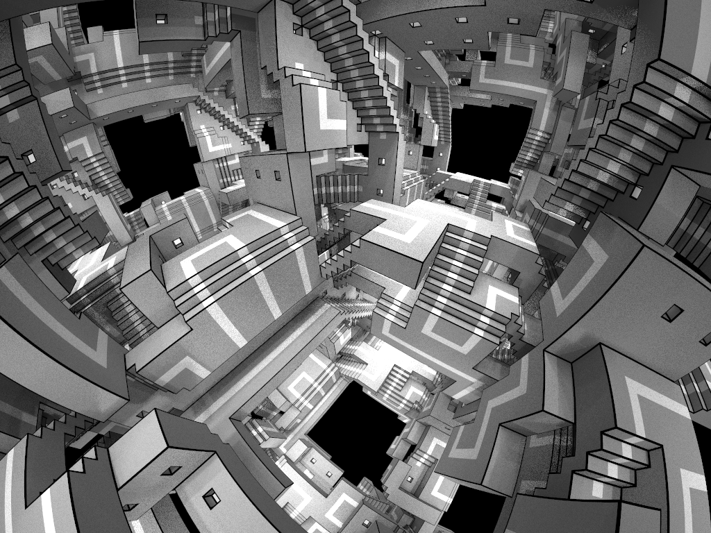
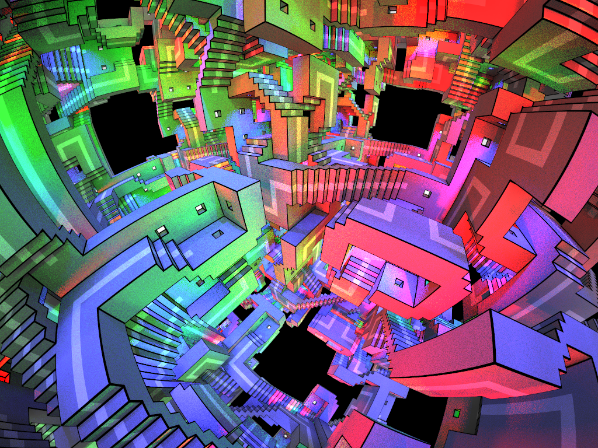
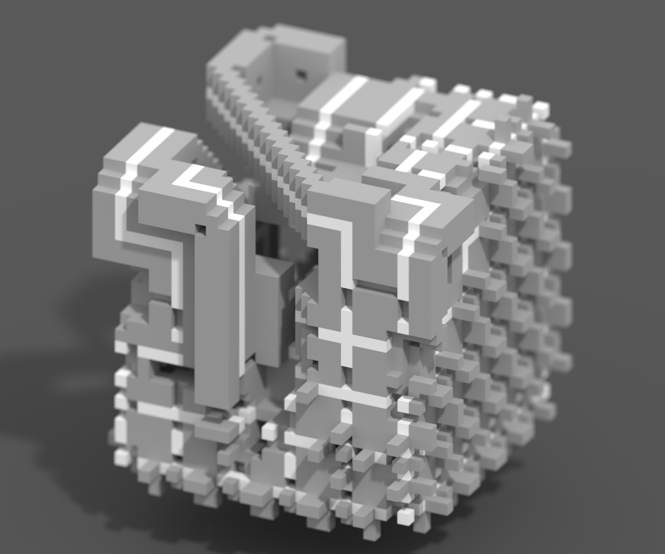

# Escheresque
Generating stairy scenes with full 3d local symmetry.

MarkovJunior models: [Escher.xml](https://github.com/mxgmn/MarkovJunior/blob/master/models/Escher.xml), [EscherSurface.xml](https://github.com/mxgmn/MarkovJunior/blob/master/models/EscherSurface.xml), [PeriodicEscher.xml](https://github.com/mxgmn/MarkovJunior/blob/master/models/PeriodicEscher.xml), [OrientedEscher.xml](https://github.com/mxgmn/MarkovJunior/blob/master/models/OrientedEscher.xml).

Twitter thread: [twitter.com/ExUtumno/status/895683455299723265](https://twitter.com/ExUtumno/status/895683455299723265)

