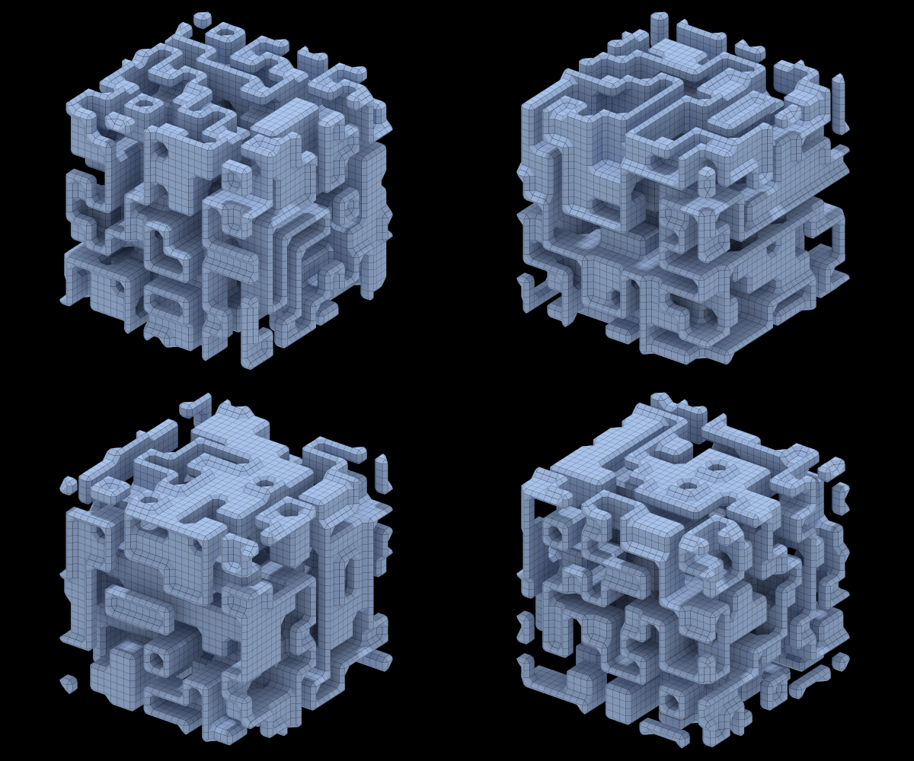
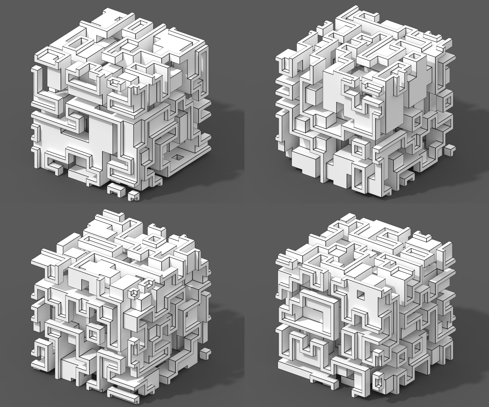

# Random surfaces
MarkovJunior model: [Surface.xml](https://github.com/mxgmn/MarkovJunior/blob/master/models/Surface.xml)

Twitter thread: [twitter.com/ExUtumno/status/900394891922071554](https://twitter.com/ExUtumno/status/900394891922071554)

