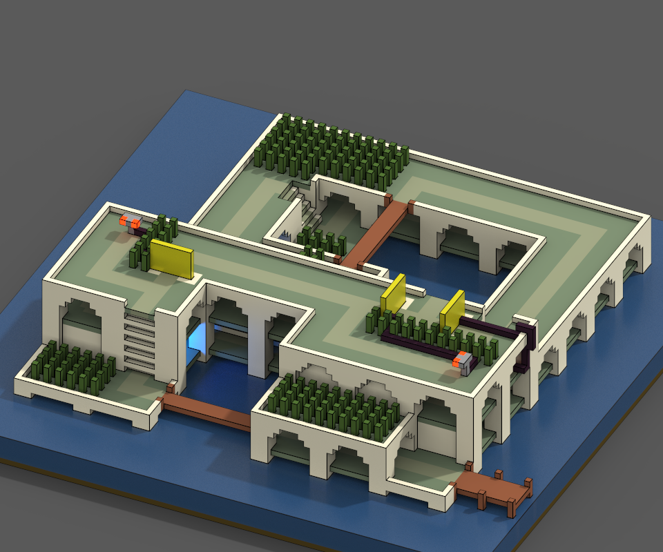
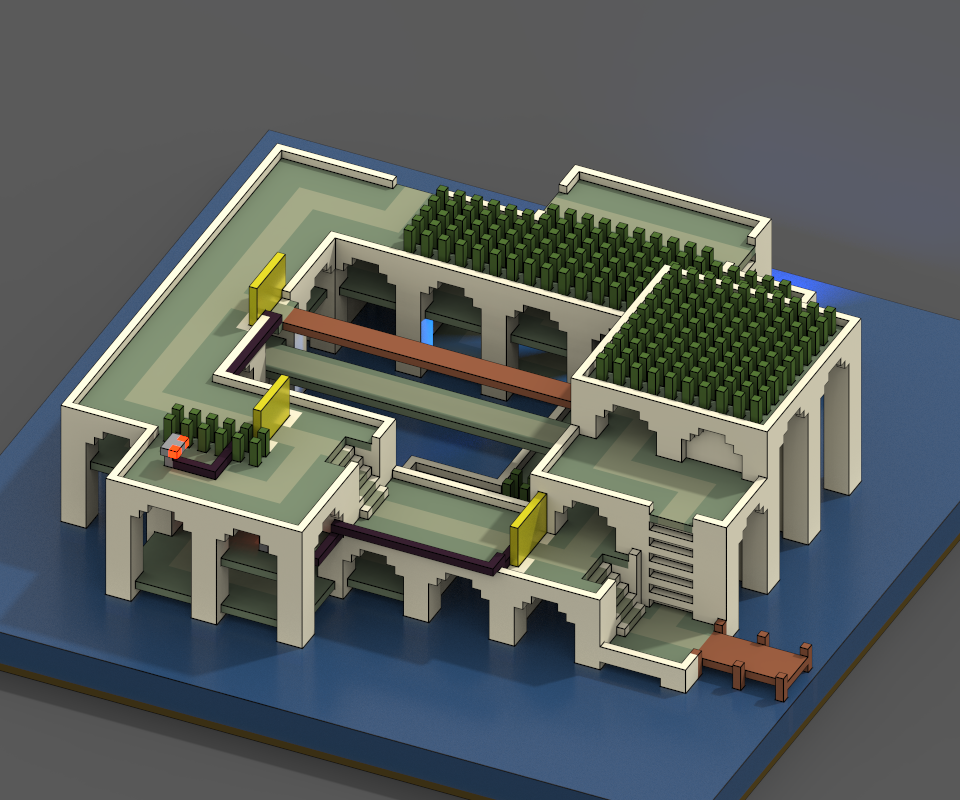
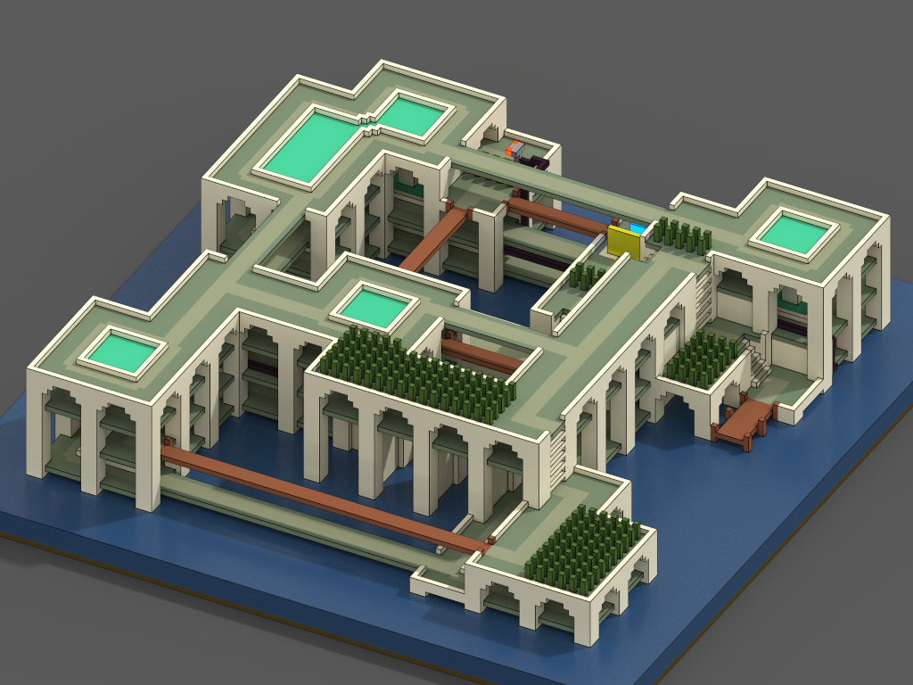
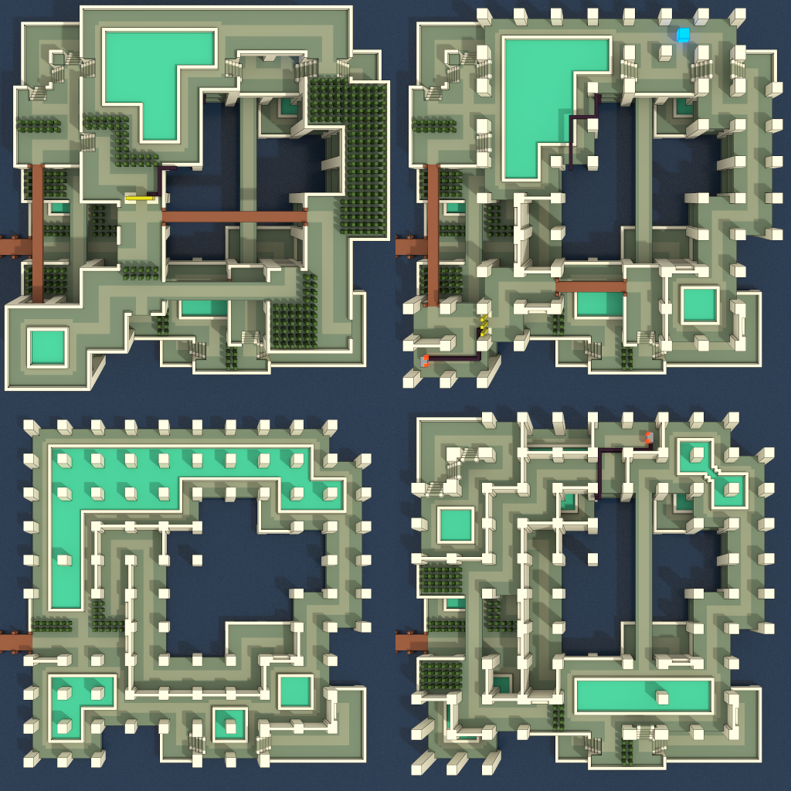

# Generator of Sea Villa puzzles
The player arrives by boat. Goal: grab the shiny blue cube and get back. Wooden bridges collapse after one pass, consoles open gates wired to them. Guaranteed to be solvable and without shortcuts.

Code: ...

Twitter thread: [twitter.com/ExUtumno/status/971031987304763393](https://twitter.com/ExUtumno/status/971031987304763393)

