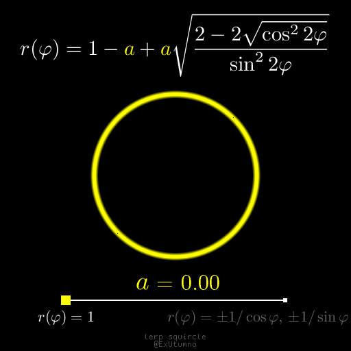
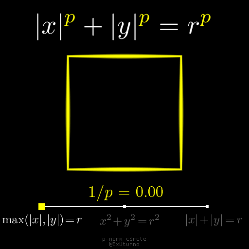
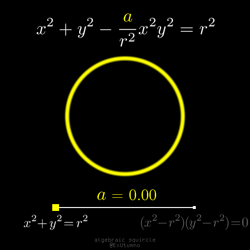
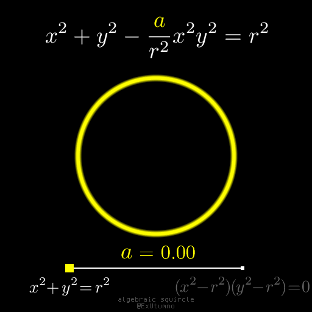

# Squircles
While [experimenting](arttopc.md) with [program synthesis](https://en.wikipedia.org/wiki/Program_synthesis), I [found](https://twitter.com/ExUtumno/status/1278713838586789889) an interesting mathematical curiosity, [squircles](https://en.wikipedia.org/wiki/Squircle). Squircle is a curve that interpolates between a square and a circle.

The most obvious way to get a squircle is just to linearly interpolate between a square and a circle in polar coordinates. However, the resulting intermediate curves are not smooth!

The most famous smooth squircle is probably the [Lamé curve](https://en.wikipedia.org/wiki/Superellipse), also known as superellipse. This squircle is actually an exact circle, but with respect to the non-Euclidean [p-norm](https://en.wikipedia.org/wiki/Lp_space) (it's Euclidean for `p=2`)!

In a [1992 paper](https://www.tandfonline.com/doi/abs/10.1080/0020739920230607), Fernández-Guasti describes an algebraic squircle. Algebraic means that it's described by an equation consisting only of variables, numbers, addition and multiplication.

Full solutions of the Fernández-Guasti's equation actually contain 4 unbounded arms in addition to the squircular figure in the middle:

You could have discovered the Fernández-Guasti squircles by looking at the function `F(x,y)=1-x^2-y^2+x^2y^2`. Its level sets are expanding squircles: the unit square is the `0`-set, and near the center `x^2y^2` is too small, so the level sets tend to be circles in the center.

Additional material:
1. [Original paper](https://www.tandfonline.com/doi/abs/10.1080/0020739920230607) by Fernández-Guasti. Paywalled, accessible via Sci-Hub.
2. In [Squircular Calculations](https://arxiv.org/vc/arxiv/papers/1604/1604.02174v1.pdf) Chamberlain Fong generalizes Fernández-Guasti squircle to 3d.
